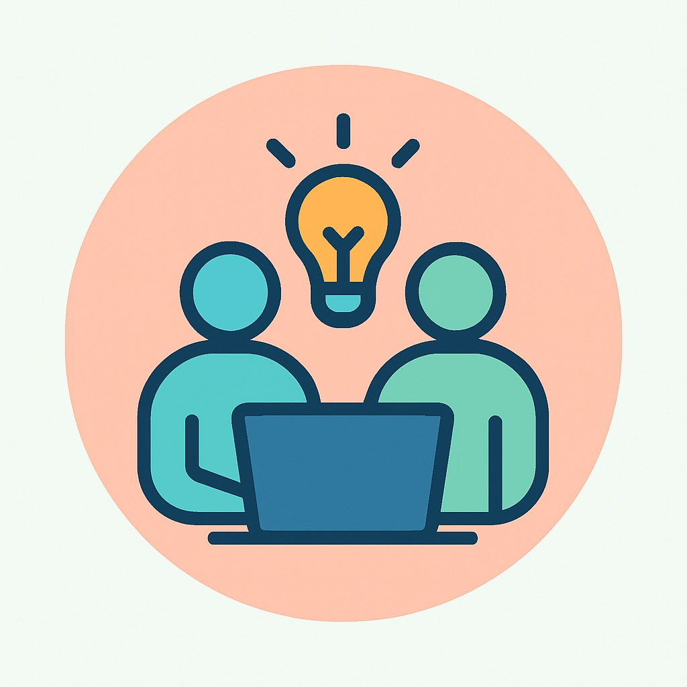

# Abschlussbericht Software Engineering 2-LearnTogether 
<br>

## Projektidee und Zielsetzung

Im Rahmen des Moduls "Software Engineering 2" haben wir als Dreierteam das Webprojekt "LearnTogether" entwicklet. Die Idee ist aus einer sehr persönlichen Erfahrung enstanden. Uns selbst fällt es im Studium manchmal schwer, uns allein zum Lernen zu motivieren. In Gesprächen haben wir festgestellt, dass viele andere Studierende und auch Schülerinnen und Schüler ähnliche Probleme haben. Die Probleme waren immer gleich: fehlende Struktur, mangelnde Motivation oder das Gefühl, mit Fragen allein zu sein. Daraus hat sich unser Wunsch entwickelt, eine Plattform zu schaffen, die gemeinsames, digitales Lernen unterstützt.

Das Ziel war es, eine schulische Sozial-Media-Plattform zu entwickeln, auf der sich Schülerinnen und Schüler, Studierende und Lehrkräfte registrieren und austauschen können. Nutzerinnen und Nutzer sollen Beiträge mit Bildern posten, kommentieren und sich gegenseitig beim Lernen unterstützen können. Dabei sollte die Plattform eine sichere, motivierende und strukturierte Umgebung bieten. Durch gemeinsames Lernen soll der Spaßfaktor erhöht, die Motivation gestärkt und der Lernprozess insgesamt erfolgreicher werden. 


## Scrum-Rollen und Projektorganisation

Wir haben uns für eine agile Umsetzung nach dem Scrum-Framework entscheiden, wie es auch im Vorlesungsskript "SE-Methoden" ausführlich erläutert wird. Scrum ist ein leichtgewichtiges, iteratives Vorgehensmodell zur Softwareentwicklung, das auf Selbstorganisation und kontinuierlicher Verbesserung basiert. Es unterteilt den Entwicklungsprozess in kurze Zyklen, sogenannte Sprints, in denen konkrete Teilziele umgesetzt werden. Ein Sprint beginnt mit dem Sprint Planning, gefolgt von täglichen Abstimmungen im Daily Scrum, und endet mit einem Sprint Review und einer Retrospektive. 

In der Anfangsphase haben wir im Team unsere Rollen festgelegt. Ich, Kristina Baotic, habe die Rolle der Product Owner übernommen. Claire Doerr war unsere Scrum Masterin und Emely Mayer bildete gemeinsam mit uns das Entwicklungsteam. Als Product Owner war ich für die Definition und Priorisierung der Anforderungen im Product Backlog verantwortlich. Ich habe sichergestellt, dass die Teammitglieder immer über die aktuellen Ziele informiert waren und die Vision des Produkts nicht aus dem Blick verloren wurde.

Alle Aufgaben wurden auf einem gemeinsamen Trello-Board dokumentiert und verwaltet. Unser Board ist unter folgendem Link erreichbar: https://trello.com/b/BSbFucSi/projekt-se-ii. Dort haben wir die Tasks in „To Do", „In Progress", „Done" und „Termine“ unterteilt und haben sie klar einzelnen Personen zugeordnet. Dieses visuelle Aufgabenmanagement war für uns besonders hilfreich, um den Fortschritt jederzeit im Blick zu behalten.

Unsere Zusammenarbeit war stark geprägt von den agilen Prinzipien wie Selbstorganisation, direkte Kommunikation und iterative Umsetzung. Wir haben 2 Mal wöchentlich virtuelle Stand-up-Meetings über MS Teams durchgeführt und haben uns regelmäßig über Fortschritte sowie nächste Schritte ausgetauscht. Ergänzt wurde dies durch Retrospektiven, in denen wir unsere Zusammenarbeit reflektiert haben und Verbesserungsvorschläge für die nächsten Sprints diskutiert haben. Zusätzlich erstellten wir ein gemeinsames Repository auf GitHub, auf das alle Teammitglieder Zugriff hatten. Dort haben wir regelmäßig neue Code-Versionen hochgeladen, um unsere Arbeit zentral zu dokumentieren, Änderungen nachvollziehbar zu machen und effizient zusammenzuarbeiten. Ohne GitHub wäre die Online-Zusammenarbeit deutlich schwieriger gewesen. So hatten wir jederzeit eine klare Struktur darüber, wer was gemacht hatte und wann neue Inhalte hochgeladen wurden. Die enge Orientierung an den Scrum-Elementen hat uns geholfen, strukturiert zu arbeiten und flexibel auf Herausforderungen zu reagieren. 


## Technische Umsetzung: Frontend

Technisch haben wir auf eine Kombination aus HTML, CSS und JavaScript für das Frontend gesetzt. Bereits zu Beginn unseres Projekts stand die gemeinsame Vision der Plattform im Mittelpunkt. In unserem ersten Team-Meeting haben wir Ideen darüber ausgetauscht, wie unsere Social-Media-Plattform strukturiert und visuell gestaltet sein sollte. Alle Teammitglieder haben eigene Vorschläge eingebracht, und schnell waren wir uns einig, dass die Seite freundlich, einladend und motivierend wirken sollte, denn Lernen soll nicht nur effektiv, sondern auch angenehm sein.

Gemeinsam haben wir über Farben, Layout und Benutzerführung diskutiert. Wir haben uns bewusst für fröhliche und bunte Farbtöne entscheiden, da Studien zeigen, dass Farben wie Türkis, Orange oder Gelb die Konzentration und Motivation beim Lernen fördern können. Mithilfe von Mockup-Tools haben wir frühe Entwürfe der Oberfläche erstellt, die uns bei der Umsetzung als Orientierung gedient haben. Diese Visualisierungen hat uns sehr dabei geholfen, ein gemeinsames Verständnis für Struktur und Benutzerführung zu entwickeln.

Im zweiten Teammeeting haben wir die konkrete Aufgabenteilung im Bereich Frontend geplant. Ich habe die Verantwortung für die sogenannte Basisseite übernommen, also das Grundlayout mit Header und Footer, welches als Template für alle weiteren Seiten diente. 

Hier ein Ausschnitt aus dem HTML-Template der Basisseite:

```html
<!-- Logo + Name und Profil bearbeiten -->
<div id="header">
    <div id="logo">
         
        <span id="logo-text">LearnTogether</span>
    </div>

    <div id="profilbearbeiten">
        <button type="button">
            <a href="">Profil</a>
        </button>
    </div>
</div>
```
Und ein Auszug aus dem zugehörigen CSS:

```css
body {
    background-color: rgb(242, 247, 209);
    font-family: Arial, Helvetica, sans-serif;
    margin: 0;
    padding: 0;
}

#header {
    display: flex;
    justify-content: space-between;
    align-items: center;
    padding: 15px 20px;
    margin-left: 80px;
}

#logo {
    display: flex;
    align-items: center;
}

#logo img {
    height: 80px;
    width: 80px;
    border-radius: 50%;
    margin-right: 10px;
}

#logo-text {
    font-size: 23px;
    font-weight: bold;
    color: #006C84;
}
```
 
Außerdem war ich für die zentrale CSS-Datei zuständig, die wir kontinuierlich erweitert und gepflegt haben. Auf Basis dieser Struktur konnten alle weiteren HTML-Seiten das Layout übernehmen und lediglich ihren jeweiligen Hauptinhalt anpassen. Damit war das Frontend technisch frühzeitig solide aufgestellt und hat eine klare Struktur geliefert.

Ein weiteres zentrales Element war die Registrierungsseite. Hier ein Auszug aus dem entsprechenden HTML-Code:

```html
<section id="registrieren">
    <div id="registrierung-content">
        <div id="logo" style="margin-top: 80px;">
             
            <span id="logo-text">LearnTogether</span>
        </div>
        <p style="font-weight: bold;">Registrieren</p>
        <form method="POST" action="" id="registrierung-text">
            
            <input type="text" name="vorname" placeholder="Name" required>
            <input type="text" name="nachname" placeholder="Nachname" required>
            <input type="text" name="email" placeholder="E-Mail-Adresse" required>
            <input type="date" name="geburtsdatum" placeholder="Geburtsdatum" required>
            <input type="text" name="username" placeholder="Username" required>
            <input type="password" name="password" placeholder="Password" required>
            <button type="submit">Registrieren</button>
            <p style="font-size: 12px; font-weight: bold; margin-top: 40px;">
                Hast du schon ein Account? <a href="">Hier geht es zum Login.</a>
            </p>
        </form>
    </div>
</section>
```

Diese Seite ermöglicht die Eingabe grundlegender Nutzerdaten wie Name, Geburtsdatum, E-Mail und Passwort. Die Formulardaten werden per POST-Methode übermittelt, die Authentifizierung und Login hat aber die Frau Dörr übernommen. Die Seite wurde durch einen Link mit der Login-Seite verbunden, deren HTML-Struktur folgendermaßen aussieht:

```html
<section id="login">
    <div id="login-content">
        <div id="logo">
            
            <span id="logo-text">LearnTogether</span>
        </div>
        <p style="font-weight: bold;">Anmelden</p>
        <form method="POST" action="" id="login-text">
            
            <input type="text" name="username" placeholder="Username" required>
            <input type="password" name="password" placeholder="Password" required>
            <button type="submit">Anmelden</button>
        </form>
        <p style="font-size: 12px; font-weight: bold; margin-top: 40px;">
            Du hast noch kein Konto? <a href="">Registrieren</a>
        </p>
    </div>
</section>
```

Durch die wechselseitige Verlinkung konnten Benutzerinnen und Benutzer einfach zwischen Registrierung und Anmeldung wechseln. Beide Seiten greifen auf das gemeinsame Layout und CSS zurück und bieten somit eine konsistente Nutzererfahrung.


## Technische Umsetzung: Backend

Für die Umsetzung des Backends installierte ich zunächst Django. Danach erstellte ich mit dem Befehl django-admin startproject das Hauptprojekt und fügte mit python manage.py startapp die Anwendung "meine\_app" hinzu. 

Vor der konkreten Entwicklung meines Funktionsbereichs habe ich das Django-Projekt auf meinen Server hochgeladen und habe die Ordnerstruktur sowie die statischen Pfade gerichtet.

Mein Schwerpunkt lag dabei auf der Umsetzung der Upload-Funktion für Bilder und Beschreibungen sowie der Verwaltung, Speicherung und Anzeigen von Bildbeschreibungen und Bilder.

Ziel war es, dass registrierte Nutzerinnen und Nutzer über ein Formular eigene Bilder mit einer Beschreibung hochladen können. Diese Bilder sollten dann gemeinsam mit ihrer Beschreibung auf der Startseite und eigener Profilseite angezeigt werden. Anstelle einer klassischen Datenbank, wie zum Beispiel SQLite, habe ich mich bewusst dafür entscheiden, alle Bildinformationen in einer statischen JSON-Datei zu speichern, die auf dem Server liegt. So wurde der Umgang mit Daten für uns als Lernende transparent nachvollziehbar.

Der Datei-Upload wurde in der views.py-Datei durch die Funktion saveUploadedFile umgesetzt. Diese View ist über die URL /upload in der urls.py eingebunden:

path("upload", app\_views.saveUploadedFile, name="upload").

Die view.py verarbeitet das übermittelte Bild sowie die zugehörige Beschreibung, speichert die Datei im statischen Verzeichnis und aktualisiert anschließend die Datei beschreibungen.json wie folgt:

```python
def saveUploadedFile(request):
    if request.method == "POST" and request.FILES.get("datei"):
        datei = request.FILES["datei"]
        beschreibung = request.POST.get("titel", "")

        fs = FileSystemStorage(location=UPLOAD_VERZEICHNIS)
        filename = fs.save(datei.name, datei)

        if os.path.exists(BESCHREIBUNGEN_DATEI):
            with open(BESCHREIBUNGEN_DATEI, "r") as datei:
                try:
                    beschreibungen = json.load(datei)
                except:
                    beschreibungen = {}
        else:
            beschreibungen = {}

        neuer_eintrag = {
            "beschreibung": beschreibung,
            "benutzer": request.session.get("username", "unbekannt")
        }
        beschreibungen[filename] = neuer_eintrag

        with open(BESCHREIBUNGEN_DATEI, "w") as datei: 
            json.dump(beschreibungen, datei)

        return redirect("startseite")
    return HttpResponse("Kein Bild hochgeladen oder Fehler aufgetreten")
```

Sowohl die hochgeladenen Bilder als auch die Datei beschreibungen.json werden im gleichen statischen Ordner (/var/www/static/images) gespeichert. Dadurch sind alle bildbezogenen Daten zentral organisiert und leicht auffindbar. Diese Datei enthält für jedes hochgeladene Bild den Namen des Benutzers und die Bildbeschreibung, z. B.:
```
{

"Umwandlungen.jpg": {"beschreibung": "n", "benutzer": "zb"}, 

"Mein-Mathe-Projekt.png": {"beschreibung": "mathematik", "benutzer": "zb"}, 

}
```
Zum Anzeigen der Beiträge auf der Startseite wurde in der View startseite() der Inhalt dieser Datei geladen und in das Template übergeben:
```python
def startseite(request):
    if os.path.exists(BESCHREIBUNGEN\_DATEI):
    with open(BESCHREIBUNGEN\_DATEI, "r") as datei:
try: 
   beschreibungen = json.load(datei)
except:
    beschreibungen = {}
else:
    beschreibungen = {}
return render(request, "meine\_app/startseite.html", {"posts": beschreibungen})
```
So können alle Nutzerinnen und Nutzer nach dem Login die Übersicht mit allen bisher hochgeladenen Beiträgen sehen, inklusive der dazugehörigen Beschreibung. Durch diese technische Umsetzung wurde es möglich, Wissen nicht nur zu teilen, sondern auch individuell zu kommentieren und zu beschreiben – ein zentraler Aspekt unseres Konzepts des gemeinsamen Lernens.


## Requirements Engineering

Im Bereich des Requirements Engineering haben wir eine Stakeholderanalyse durchgeführt. Als Hauptnutzergruppen identifizierten wir Schülerinnen und Schüler sowie Studierende, die Inhalte posten und kommentieren wollen und die Lehrkräfte, die Inhalte bereitstellen und moderieren möchten. Must-Have-Anforderungen wie die Registrierung, die Login-Funktion, das Posten von Inhalten mit Bildern und eine Kommentarfunktion hatten für uns oberste Priorität. Zusätzliche Features wie das Speichern von Dokumenten oder private Nachrichten waren als "Nice-to-have" gekennzeichnet und wurden für spätere Erweiterungen eingeplant. Die Erarbeitung dieser Anforderungen erfolgte zunächst in gemeinsamer Diskussion, später über die strukturierte Überführung in Backlog Items innerhalb unseres Trello-Boards. Damit wandten wir zentrale Inhalte der Vorlesungseinheit zu Requirements Engineering praktisch an.


## Projektmesse und Abschluss

Für die Abschlussmesse haben wir als Team einen attraktiven Stand geplant. Ich habe QR-Codes vorbereitet, die direkt zur Registrierungsseite geführt haben, habe die danach laminiert und geklebt auf kleine Giveaways wie Bonbons, um Neugier und Interaktion zu fördern. Zusätzlich hatte ich die Idee, die QR-Codes im Gebäude der Hochschule zu verteilen wie zum Beispiel in Aufenthaltsräumen, Fluren oder in den Raucherbeireichen. Dadurch konnten andere Studierende die Codes scannen und direkt auf unsere Plattform zugreifen. Diese Maßnahme war erfolgreich. Viele Besucherinnen und Besucher der Projektmesse kannten „LearnTogether“ bereits durch die verteilten Codes und sind gezielt an unseren Stand gekommen, um mehr zu erfahren.

Gemeinsam mit meinen Kolleginnen habe ich mich um den rechtzeitigen Aufbau unseres Messestands gekümmert. Wir waren gut vorbereitet und hatten eine klare Rollenverteilung für Gespräche, technische Demonstrationen und organisatorische Aufgaben. Am Ende hat unser Projekt sogar als den ersten Platz auf der Messe bekommen, eine besondere Anerkennung für unser Engagement und unsere gemeinsame Arbeit. Die Messe war ein wertvoller Abschluss des Projekts und hat die Gelegenheit geboten, unsere Arbeit öffentlich vorzustellen, Rückmeldungen zu erhalten und unsere Teamleistung sichtbar zu machen


## Herausforderungen und Lösungen

Zu Beginn des Projekts hatte ich persönlich die Sorge, nicht gut in einem Team arbeiten zu können. Ich war mir unsicher, ob ich mich in einer Gruppenstruktur zurechtfinden oder einbringen könnte. Doch schon nach den ersten Treffen hat sich herausgestellt, dass ich kein Einzelgänger bin. Im Gegenteil, die Arbeit im Team hat mir gut getan, und ich habe mich sehr schnell als fester Bestandteil der Gruppe gefühlt. Die gegenseitige Unterstützung und das Vertrauen untereinander haben nicht nur das Arbeitsergebnis gefördert, sondern auch mein persönliches Selbstvertrauen.

Eine weitere große Herausforderung war für mich die Arbeit im Backend. Während ich im Frontend sicherer war und Freude am Gestalten hatte, war mir das Backend mit Django zu Beginn völlig neu. Ich musste mich intensiv mit den Vorlesungsskripten auseinandersetzen, diese mehrmals durcharbeiten und viel recherchieren, um die nötige Logik für Datei-Uploads, Speicherung und Anzeige korrekt umzusetzen. Oft gab es technische Hürden, zum Beispiel beim Server oder bei der Speicherung der hochgeladenen Dateien. Wichtig war, dass ich nicht aufgegeben habe, sondern mich Schritt für Schritt weiterentwickelt habe. Durch dieses Durchhaltevermögen habe ich sehr viel dazugelernt und wertvolle Tipps für zukünftige Projekte mitgenommen.


## Erkenntnisse und persönliche Entwicklungen

Aus dem Projekt nehme ich viel mit, nicht nur technisch, sondern auch persönlich. Beim nächsten Mal würde ich mit mehr Selbstvertrauen an ein neues Projekt herangehen. Ich habe gelernt, dass Angst oft unbegründet ist und man durch Ausprobieren und Eigeninitiative am meisten lernt. Ich möchte mir künftig weniger Druck machen und den Entwicklungsprozess mehr genießen. Gerade durch das eigenständige Erarbeiten von Lösungen bleiben die Inhalte besonders gut im Gedächtnis. Ich habe außerdem erkannt, wie wichtig es ist, Fragen zu stellen, nicht nur, um schneller weiterzukommen, sondern auch, um Zusammenhänge besser zu verstehen. Insgesamt war „LearnTogether“ ein Projekt, das mich sowohl fachlich als auch menschlich wachsen ließ.

Rückblickend war das Projekt eine sehr lehrreiche Erfahrung. Besonders der Einstieg in das Django-Backend war herausfordernd, hat mich aber fachlich sehr vorangebracht. Ich habe gelernt, geduldig mit mir selbst zu sein und bei technischen Problemen nicht sofort aufzugeben. Gleichzeitig konnte ich erkennen, wie wichtig saubere Dokumentation, klare Aufgabenteilung und gegenseitige Unterstützung im Team sind. Bei einem künftigen Projekt würde ich versuchen, die Umsetzung mehr zu genießen, weniger Druck aufzubauen und mein Selbstvertrauen in meine technischen Fähigkeiten zu stärken. Unsere Teamarbeit war sehr harmonisch, wir konnten uns stets absprechen, Verantwortung übernehmen und Aufgaben gerecht verteilen. Besonders wichtig war dabei, dass wir bei aller Zielorientierung stets Spaß an der Arbeit hatten, viel lachten und ein offenes, vertrauensvolles Miteinander pflegten. Durch eine klare Aufgabenverteilung und die Fähigkeit, Kompromisse zu finden, konnten wir Herausforderungen effektiv meistern und als Team zusammenwachsen.


## GitHub-Link und Fazit

Den Quellcode unseres Projekts inklusive Dokumentation und Markdown-Bericht habe ich auf GitHub bereitgestellt:

https://github.com/KBaotic/Abschlussbericht-2.Semester-LearnTogether

Im Verlauf des Projekts konnte ich viele Kompetenzen ausbauen, sowohl in der Softwareentwicklung als auch im Bereich Teamarbeit und Projektorganisation. Das Projekt hat mir gezeigt, wie spannend es ist, ein digitales Produkt von der Idee bis zur öffentlichen Präsentation zu begleiten. Ich würde jederzeit wieder an einem ähnlichen Projekt teilnehmen, mit dem Wissen, dass Lernen durch Tun der effektivste Weg ist.


